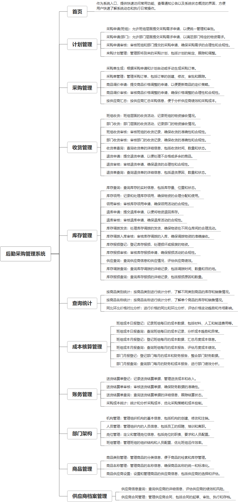

 

    
 

公司拥有上百套具有自主知识产权的软件系统，详情请查看码云首页或公司官网

 
<h1>后勤采购管理系统</h1>

<a href="https://www.haishi.net.cn/">公司官网</a> ｜ <a href="https://www.haishi.net.cn/">在线体验</a>

 

## 系统介绍

nan
nan
本项目名称为后勤采购管理系统，是一个用于管理企业后勤采购全流程的系统。系统涵盖了从采购计划制定、采购订单执行、收货管理、库存管理、成本核算到账务管理的全过程，并提供了查询统计和部门架构管理等功能。该系统旨在提高企业后勤采购效率，降低采购成本，优化库存管理，并提供全面的数据分析支持，帮助企业做出更明智的采购决策。
本项目的功能模块主要包括：计划管理、采购管理、收货管理、库存管理、查询统计、成本核算管理、账务管理、部门架构管理、商品管理、供应商档案管理等模块。
系统终端推测为Web端，面向企业内部不同角色的用户，例如采购员、库管员、财务人员、部门经理等，不同角色的用户拥有不同的权限和功能。
                

## 系统功能介绍

### 系统包含终端说明

管理端（WEB）

| 序号 | 模块 | 模块说明 |
| --- | --- | --- |
| 1 | QHY-WZGL-HQGL-SERVER | 服务端 |
| 2 | QHY-WZGL-HQGL-MANAGE | 管理端 |
| 3 | .idea | 未知类型 |

### 系统功能结构

### 系统功能说明

核心功能：
* **计划管理：** 从采购申请到采购计划的制定和审核，实现采购流程的规范化和可控性。
* **采购管理：** 包括采购单生成、管理、商品调价申请和审核，以及按供应商汇总等功能，方便采购人员进行采购作业。
* **库存管理：** 提供库存查询、领用、退库、调拨、报损等全面的库存管理功能，确保库存信息的准确性和及时性。
* **成本核算管理：** 通过班组和部门的成本日报和月报登记和查询，实现成本的精细化管理和分析。
* **账务管理：** 包括送货结算单登记、审核和查询，以及采购成本统计，为财务人员提供准确的账务数据。
其他重要功能：
* **收货管理：** 对班组和部门的收货进行管理和审核，并支持退货申请和审核，确保收货流程的规范性和完整性。
* **查询统计：** 提供按商品类别、商品名称等维度进行统计分析，以及同比环比价格对比分析，为管理层提供决策支持。
* **部门架构管理：** 包括机构、人员、岗位和班组管理，方便企业进行组织架构的管理和维护。
* **商品管理：** 对商品类别、商品名称和商品供应商进行管理，确保商品信息的完整性和准确性。
* **供应商档案管理：** 包括供应商信息查询和供应商合同管理，方便企业对供应商进行管理和评估。

## 系统主要界面

## 系统技术说明

### 代码模块说明

| 序号 | 目录 | 目录说明 |
| --- | --- | --- |
| 1 | QHY-WZGL-HQGL-SERVER/snowy-web-app | -- |
| 2 | QHY-WZGL-HQGL-SERVER/snowy-common | -- |
| 3 | QHY-WZGL-HQGL-SERVER/snowy-plugin-api | -- |
| 4 | QHY-WZGL-HQGL-SERVER/snowy-plugin | -- |
| 5 | QHY-WZGL-HQGL-SERVER/.gitee | -- |
| 6 | QHY-WZGL-HQGL-SERVER/.idea | -- |

### 系统技术选型

#### 开发语言/框架

JAVA（JDK1.8）
前端框架：VUE2
脚手架：Snowy
框架：SpringBoot2.x
系统结构：单体应用

#### 服务中间件

Nginx
Tomcat

#### 数据库

MySQL（5.7+）

#### 其他说明

无

## 系统演示/商用

请扫码添加客服微信获取演示地址和系统详细资料。

如果您想基于后勤采购管理系统进行商业化交付或定制开发服务，我们提供有偿的技术服务支持，合作模式不限，欢迎沟通！

公司官网地址： <a href="https://www.haishi.net.cn/">https://www.haishi.net.cn</a>

联系客服获取专业回答。

## 使用须知

1、 本项目商用必须获得版权所有者的授权。

2、 未经允许本项目代码不允许二次出售。

